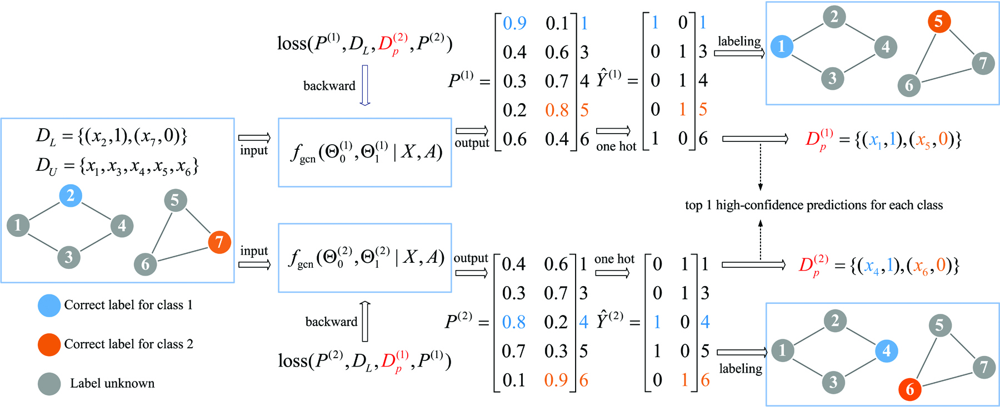

## Mutual Teaching for Graph Convolutional Networks
Graph convolutional networks produce good predictions of unlabeled samples due to its transductive label propagation. Since samples have different predicted confidences, we take high-confidence predictions as pseudo labels to expand the label set so that more samples are selected for updating models. We propose a new training method named as mutual teaching, *i.e.*, we train dual models and let them teach each other during each batch. First, each network feeds forward all samples and selects samples with high-confidence predictions. Second, each model is updated by samples selected by its peer network. We view the high-confidence predictions as useful knowledge, and the useful knowledge of one network teaches the peer network with model updating in each batch. In mutual teaching, the pseudo-label set of a network is from its peer network. Since we use the new strategy of network training, performance improves significantly. Extensive experimental results demonstrate that our method achieves superior performance over state-of-the-art methods under very low label rates.



## Citation
We appreciate it if you cite the following paper:
```
@Article{mtgcn,
  author =  {Kun Zhan and Chaoxi Niu},
  title =   {Mutual teaching for graph convolutional networks},
  journal = {Future Generation Computer Systems},
  year =    {2021},
  volume =  {0},
  number =  {0},
  pages =   {0--0},
}
```

## Contact
http://kunzhan.github.io

If you have any questions, feel free to contact me. (Email: `ice.echo#gmail.com`)